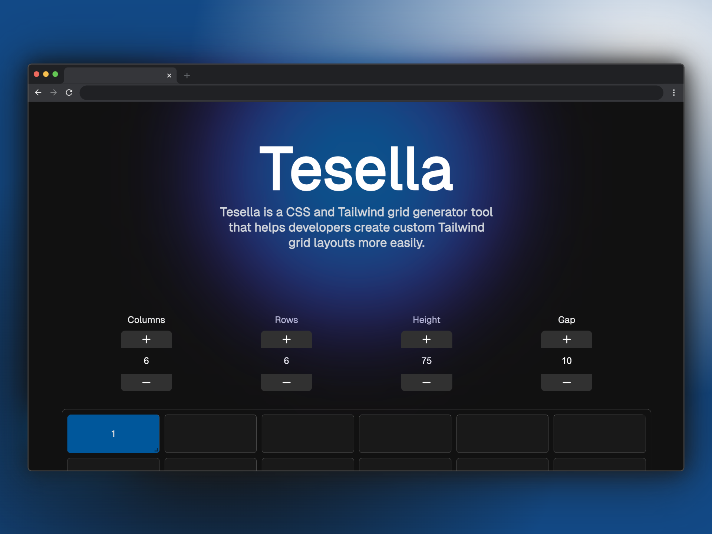

# Tesella - CSS Grid & Tailwind Generator



## About

Tesella is a powerful CSS Grid and Tailwind layout generation tool designed to help developers visually create and customize responsive grid layouts with ease. The application provides an intuitive drag-and-drop interface for designing grids and automatically generates clean, production-ready code.

## Features

- **Visual Grid Editor**: Drag-and-drop interface for designing grid layouts
- **Multi-format Code Generation**: Outputs HTML, CSS, JSX, and Tailwind code
- **Real-time Updates**: See code updates as you modify the grid
- **Customizable Parameters**: Adjust columns, rows, heights, and gap spacing
- **Modern Syntax Highlighting**: Clean, readable code snippets with copy functionality

## Getting Started

```bash
# Clone the repository
git clone https://github.com/yourusername/tesella.git

# Or visit the live site
https://tesella.vercel.app

# Navigate to project directory
cd tesella

# Install dependencies
npm install

# Start the development server
npm run dev
```

## Usage

1. Configure your grid using the controls at the top
2. Click on cells to add grid elements
3. Drag elements to position them
4. Resize elements using the handles
5. View and copy the generated code in your preferred format

For detailed instructions, see the [User Guide](src/docs/user-guide.md).

## Development

Tesella is built with React, TypeScript, and Vite. For information about the project architecture and how to contribute, please refer to the [Technical Guide](src/docs/technical-guide.md).

## License

[MIT](LICENSE)
